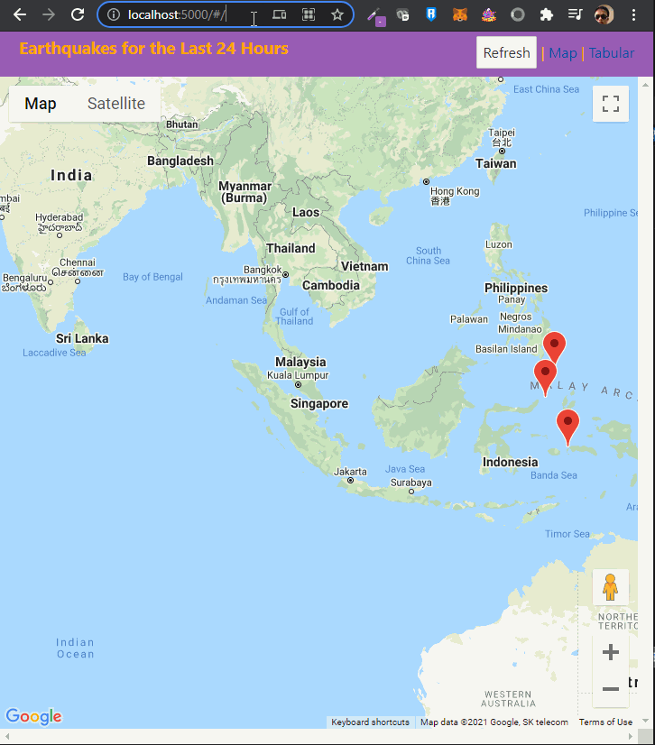

I developed it using Svelte (https://svelte.dev) because it's the frontend framework I'm most familiar with at the moment given the time constraints.

# How to run

1. clone the repository
2. run `npm install`
3. run `npm run dev` and navigate to the provided URL (usually `http://localhost:5000`)

# In Action

